# Registering the sample apps with the Microsoft identity platform and updating the configuration files using PowerShell

## Quick summary
1. Open the [Azure portal](https://portal.azure.com). Navigate to the 'Portal settings' page. Copy and save the **Directory ID** somewhere for later use.
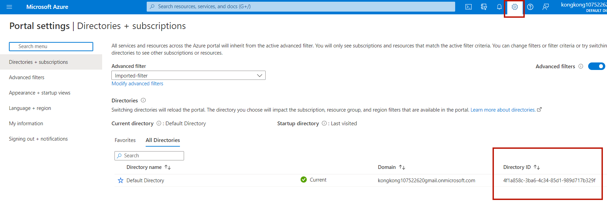

1. Open the [Azure portal](https://portal.azure.com). Navigate to the 'Subscription' page. Copy and save the **Subsription ID** under that directory somewhere for later use.
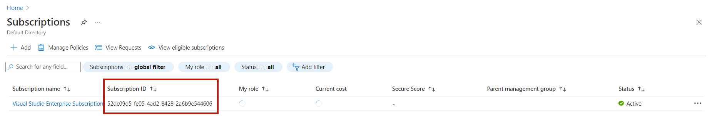

1. Download [PowerShell](https://learn.microsoft.com/en-us/powershell/scripting/install/installing-powershell?view=powershell-7.2), [PowerShellGet](https:/s/learn.microsoft.com/en-us/powershell/scripting/gallery/installing-psget?view=powershell-7.2) and [Bicep tool](https://learn.microsoft.com/en-us/azure/azure-resource-manager/bicep/install)

1. Run PowerShell navigate to the directory

1. Run the script to create your Azure AD tenant and enter the parameters (tenantId - Directory ID ; subscriptionId - Subsription ID) accordingly. During this process, two pop-ups will appear asking you to enter your identity information.

   ```PowerShell
   cd .\Scripts\
   .\1-authentication.ps1
   ```

Now you have done the following work by script:
- Create a CIAM tenant.
- Create the app registration with offline_access and open_id permission
- Create a service principal for the app.
- Create a user flow as the default one.
- Create a customized localization branding as the default one.


## More details
- [How to use the scripts?](#how-to-use-the-scripts)
    - [Pre-requisites](#pre-requisites)
    - [Run the creation script and start running step by step](#run-the-creation-script-and-start-running-step-by-step)
    - [Run the deletion script and start cleaning step by step](#run-the-deletion-script-and-start-cleaning-step-by-step)
- [Goal of the provided scripts](#goal-of-the-provided-scripts)
    - [Presentation of the scripts](#presentation-of-the-scripts)
    - [Usage pattern for tests and DevOps scenarios](#usage-pattern-for-tests-and-DevOps-scenarios)
    - [Explanation on the scripts](#explanation-on-the-scripts)


## How to use the scripts?

### Pre-requisites
1. Download [PowerShell](https://learn.microsoft.com/en-us/powershell/scripting/install/installing-powershell?view=powershell-7.2), [PowerShellGet](https://learn.microsoft.com/en-us/powershell/scripting/gallery/installing-psget?view=powershell-7.2) and [Bicep tool](https://learn.microsoft.com/en-us/azure/azure-resource-manager/bicep/install)
1. Open PowerShell (On Windows, press  `Windows-R` and type `PowerShell` in the search window)
1. Navigate to the root directory of the project.

### Run the creation script and start running step by step
1. Open the [Azure portal](https://portal.azure.com). Navigate to the 'Portal settings' page. Copy and save the **Directory ID** somewhere for later use.


1. Open the [Azure portal](https://portal.azure.com). Navigate to the 'Subscription' page. Copy and save the **Subsription ID** under that directory somewhere for later use.


1. Download [PowerShell](https://learn.microsoft.com/en-us/powershell/scripting/install/installing-powershell?view=powershell-7.2), [PowerShellGet](https:/s/learn.microsoft.com/en-us/powershell/scripting/gallery/installing-psget?view=powershell-7.2) and [Bicep tool](https://learn.microsoft.com/en-us/azure/azure-resource-manager/bicep/install)

1. From the folder where you cloned the repo, go to the `Scripts` folder. Run the script to create your Azure AD tenant and enter the parameters accordingly *(tenantId - Directory ID ; subscriptionId - Subsription ID)*. During this process, two pop-ups will appear asking you to enter your identity information.

   ```PowerShell
   cd .\Scripts\
   .\1-authentication.ps1
   ```

1. After finishing running the creation script, go to the application page in the portal, open the [Azure portal](https://portal.azure.com) and navigate to the 'Portal settings' page. Switch to the tenant newly created by the script.
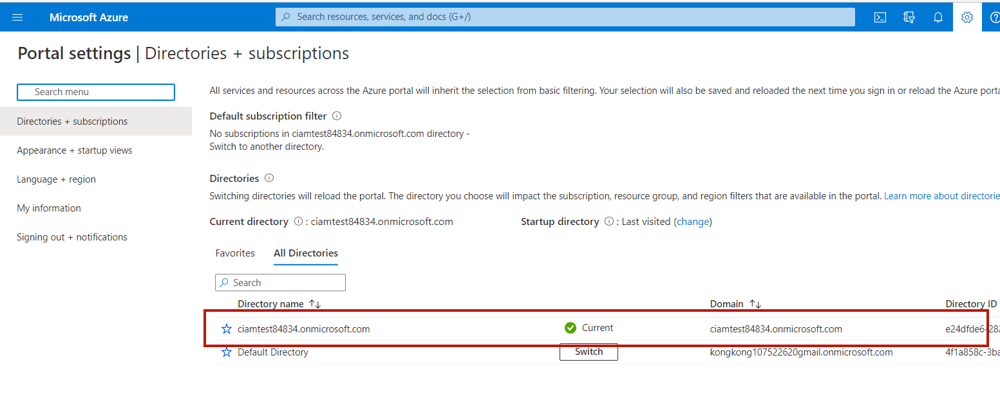

1. Copy the link appeared in the PowerShell interface and visit that link through browser *(If you did not switch to the correspond tenant in the previous step, you are likely to meet problem in this step)*. Copy **Application (client) ID** and **Directory (tenant) ID** which are used in later steps.
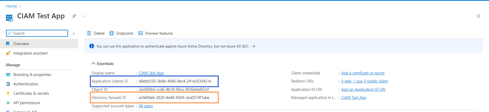

1. In the **API permissions** tab under the application page, click **Grant admin consent {tenant domain}** button.
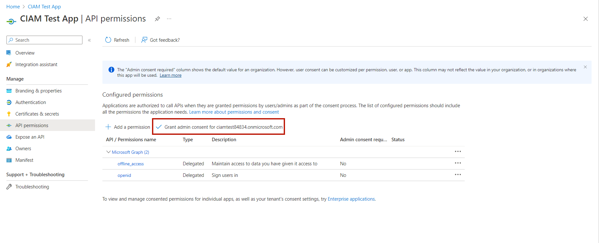
After granting
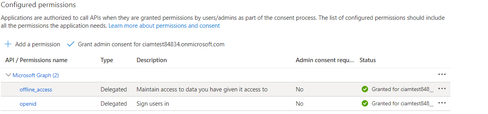

1. You can use [Javascript sample appliation](https://github.com/Azure-Samples/ms-identity-javascript-tutorial/tree/main/1-Authentication/1-sign-in/App) to test functionality. Under **"ms-identity-javascript-tutorial\1-Authentication\1-sign-in\App"**, open **authConfig** file to replace the **Application (client) ID** and **Directory (tenant) ID** as figure showed.
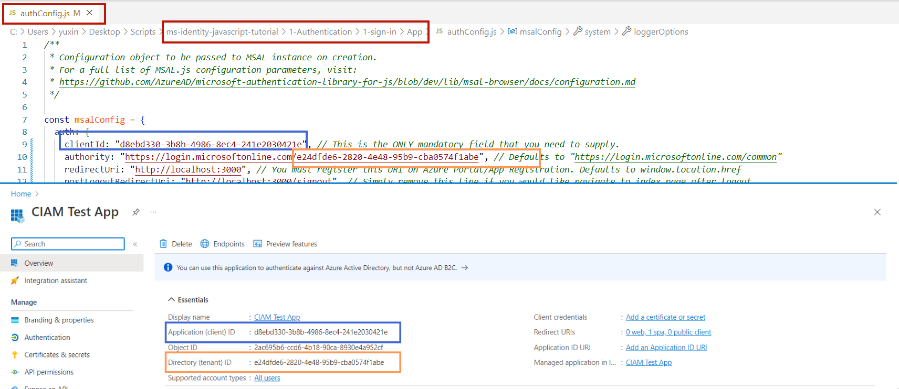

1. Start the sample application using the lines below in the PowerShell. This step require [Node.js](https://nodejs.org/en/) installed.

   ```PowerShell
   cd ms-identity-javascript-tutorial\1-Authentication\1-sign-in\App
   npm install
   npm start
   ```
    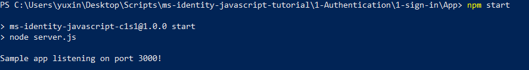

1. Open your browser and visit **http://localhost:3000/**. You will see the page as the figure showed *(recommended to use Edge private view mode)*.
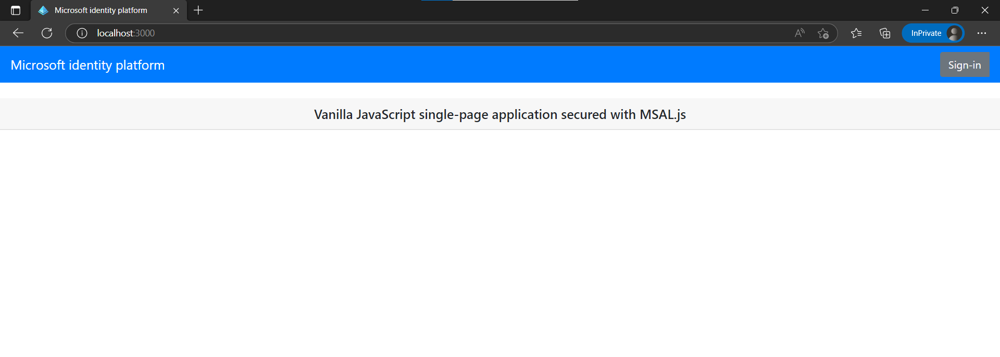

1. Click **Sign-in** at the right-up corner to start the authentication flow. If choose **Have an account? Sign in instead**, you are going to jump into sign-up flow.
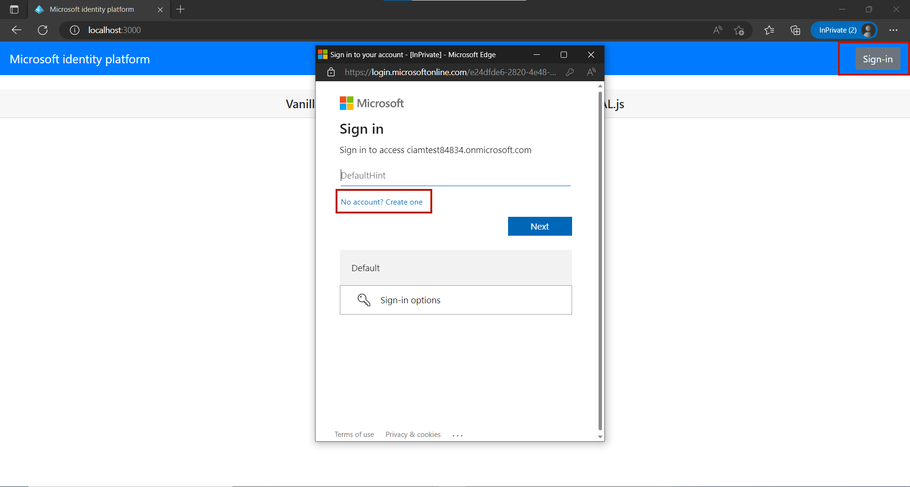

1. After filing in your email, one time passcode and new password, you complete the whole sign-up flow. The page will show your newly created information as the figure showed.
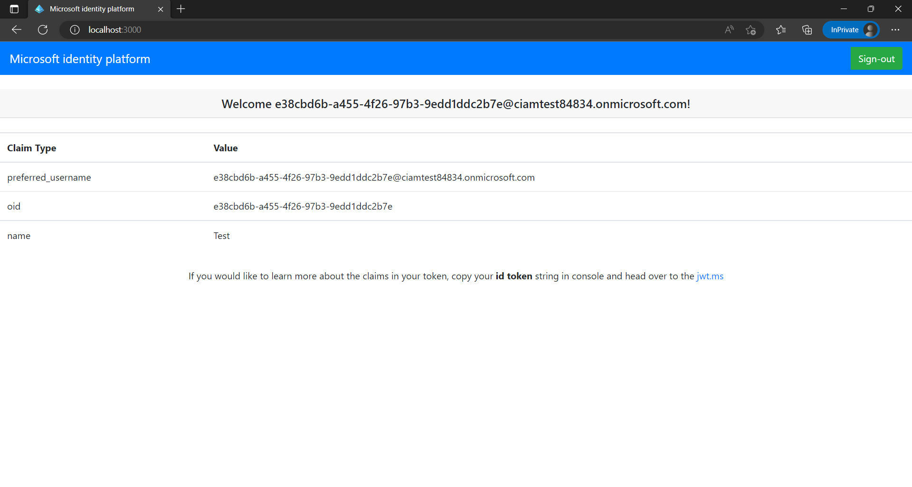

1. Click the **Sign-out** at the right-up corner to sign-out. The following pages are showed below.
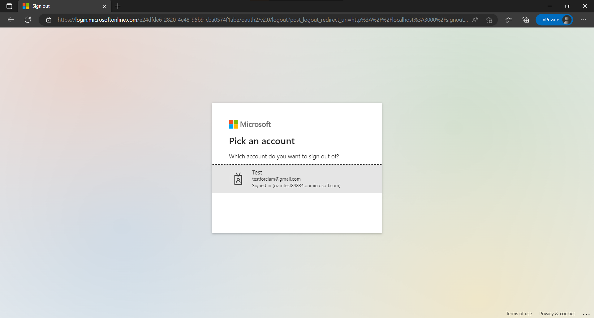
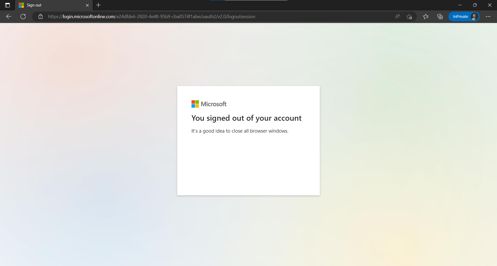


### Run the deletion script and start cleaning step by step
1. From the folder where you cloned the repo, go to the `Scripts` folder. Run the script to create your Azure AD tenant and enter the parameters accordingly *(tenantId - the directory ID you want to delete)*.

   ```PowerShell
   cd .\Scripts\
   .\1-authentication-cleanup-except-last-CIAM.ps1
   ```
    You will You will encounter some errors due to the issue TODO but this script still works fine to achieve our goal.
    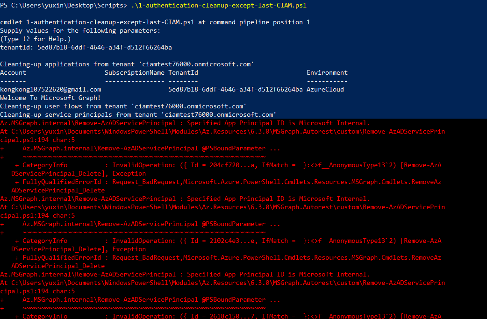

1. After running the deletion script, all initial checks in the portal should pass except 'Users' & 'Users Flow' because of the issues TODO. Click **'Delete all users'** to manually delete all users except from the admin user.
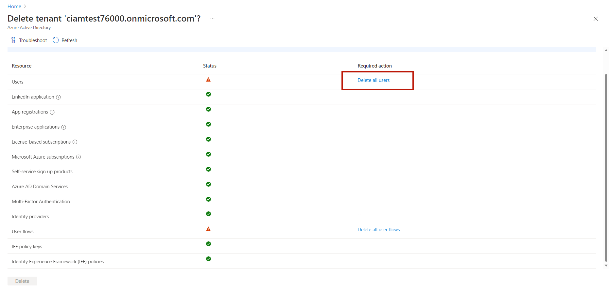
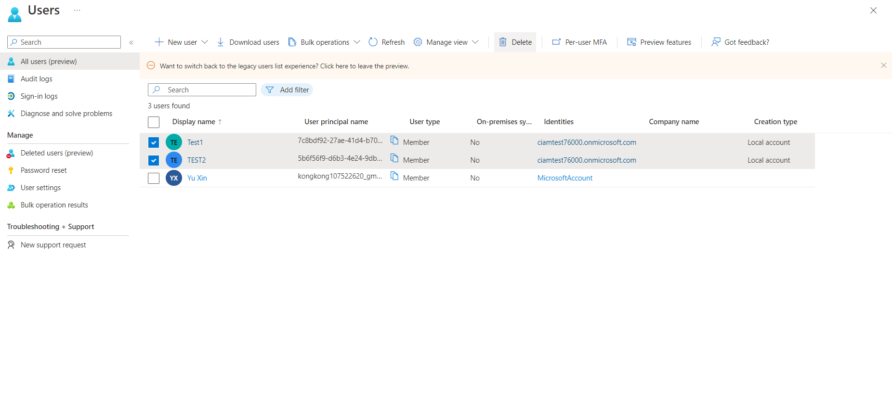

1. Back to the 'Deletion tenant' page and then click **Refresh** button. The **Delete** button will be activated after refreshing. You do not need to worry about the 'Delete all user flows' hint due to the issue TODO. Click **Delete** button to complete the last action to delete the tenant.
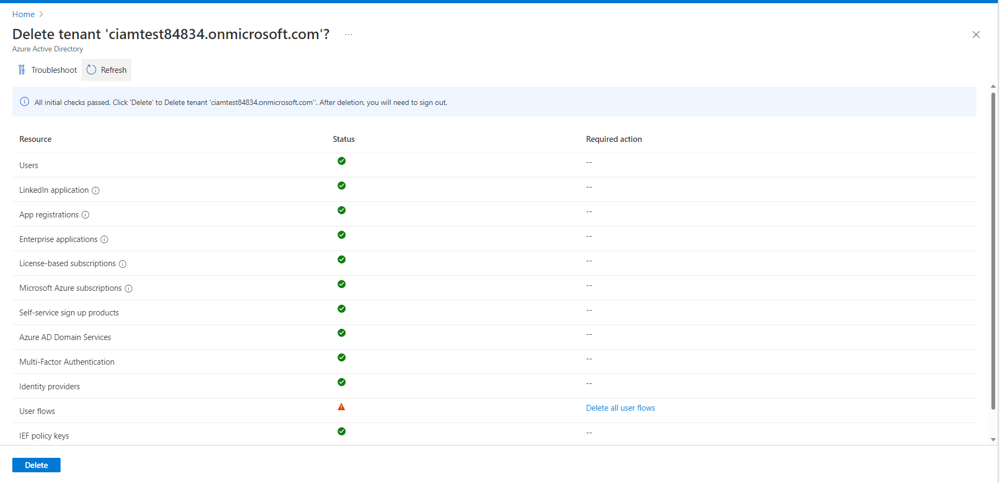


## Goal of the provided scripts

### Presentation of the scripts

This sample comes with 5 PowerShell scripts and 1 bicep file, which automate the creation of the Azure Active Directory tenant, and the configuration of the code for this sample. Once you run them, you will only need to build the solution and you are good to test.

These scripts are:
- `1-authentication.ps1` which is a overall script combining the following scripts together except from `1-authentication-cleanup-except-last-CIAM.ps1`

- `1-authentication-setup-context-CIAM.ps1` which:
  - check and install the required modules.
  - set the policy and unblock the scripts to run.
  - set the account context to run the AzAccount PowerShell lines.

- `1-authentication-create-tenant-CIAM.ps1` which use [New-AzResourceGroupDeployment](https://learn.microsoft.com/en-us/powershell/module/az.resources/new-azresourcegroupdeployment?view=azps-9.1.0) with bicep file to deploy tenant. A tenant will be created in a resrouce group.

- `1-authentication-configurate-app-CIAM.ps1` which:
  - create the app registration
  - create a service principal for the app
  - create a user flow
  - customize the branding of the text information
  - creates a summary containing:
    - the identifier of the application
    - the AppId of the application
    - the url of its registration in the [Azure portal](https://portal.azure.com).

- `1-authentication-cleanup-except-last-CIAM.ps1` which cleans-up the Azure AD objects created by `1-authentication.ps1`. Note that this script delete applications, service principals, user flows and elevate the role but does not delete resource group. It prepare for the last delete click in the portal to delete tenant.

### Usage pattern for tests and DevOps scenarios

The `1-authentication.ps1` contain resource existence checking logic. It will skip the creation step for an existing resource and exit if the creation fails or an error occurs. So you can re-run the script. The `1-authentication-cleanup-app-CIAM` can be re-run as well.

### Explanation on the scripts

#### `1-authentication-setup-context-CIAM.ps1`

**Mandatory** parameters:
|parameters|explanation|
|:---------------:|:---------------:|
|    tenantId     | Tenant ID where the subscription ID is located  |
| subscriptionID  | Subscription ID used to pay for the new tenant  |

References:  
- [Install the Azure Az PowerShell module | Microsoft Learn](https://learn.microsoft.com/en-us/powershell/azure/install-az-ps?view=azps-9.0.1)
- [Install the Microsoft Graph PowerShell SDK | Microsoft Learn](https://learn.microsoft.com/en-us/powershell/microsoftgraph/installation?view=graph-powershell-beta)
- [Set-ExecutionPolicy (Microsoft.PowerShell.Security) - PowerShell | Microsoft Learn](https://learn.microsoft.com/en-us/powershell/module/microsoft.powershell.security/set-executionpolicy?view=powershell-7.2)

#### `1-authentication-create-tenant-CIAM.ps1`

**Optional** parameters: 
|parameters|explanation|
|:---------------:|:---------------:|
| resourceGroupName | Resource Group Name (Default: "ciamtest") |
| tenantPrefix | Prefix for Tenant (Default: "ciamtest" + 5-digit random string) |
| resourceGroupLocation | Location for Resource Group if it is created (Default: "northeurope") |

References: 
- [New-AzResourceGroupDeployment (Az.Resources) | Microsoft Learn](https://learn.microsoft.com/en-us/powershell/module/az.resources/new-azresourcegroupdeployment?view=azps-9.0.1)

#### `1-authentication-configure-app-CIAM.ps1`

**Mandatory** parameter:
|parameters|explanation|
|:---------------:|:---------------:|
| tenantId | Tenant ID newly created |

**Optional** parameters: 
|parameters|explanation|
|:---------------:|:---------------:|
| applicationName | Display Name for application (Default: "CIAM Test App") |
| environmentName | Graph environment to use while running the script (Default: "Global") |

References: 

1. Establish connection.

    [Using Microsoft Graph PowerShell authentication commands | Microsoft Learn](https://learn.microsoft.com/en-us/powershell/microsoftgraph/authentication-commands?view=graph-powershell-beta)

1. Create the app registration.

    [Get-MgApplication (Microsoft.Graph.Applications) | Microsoft Learn](https://learn.microsoft.com/en-us/powershell/module/microsoft.graph.applications/get-mgapplication?view=graph-powershell-beta) 

1. Create a service principal for the app.

    [Get-MgServicePrincipal (Microsoft.Graph.Applications) | Microsoft Learn](https://microsofteur-my.sharepoint.com/:w:/g/personal/yuxin_microsoft_com/EbSicA2AWIlPjkydtgQsPhABNK8dxNZM03eYFJEiZ_ty7A?e=9I1Zwz)

1. Create a user flow *(MS Graph API, no available command line)*.

    [ciam/API#3-CIAM-user-flows.md at main · microsoft-entra/ciam (github.com)](https://github.com/microsoft-entra/ciam/blob/main/API%233-CIAM-user-flows.md)

1. Customize the experience.

    [Get organizationalBrandingLocalization - Microsoft Graph beta | Microsoft Learn](https://learn.microsoft.com/en-us/graph/api/organizationalbrandinglocalization-get?view=graph-rest-beta&tabs=http) 

#### `1-authentication-cleanup-app-CIAM.ps1`
**Mandatory** parameter:
|parameters|explanation|
|:---------------:|:---------------:|
| tenantId | Tenant ID newly created |

**Optional** parameters: 
|parameters|explanation|
|:---------------:|:---------------:|
| applicationName | Display Name for application (Default: "CIAM Test App") |
| environmentName | Graph environment to use while running the script (Default: "Global") |

References:
- [Delete an Azure Active Directory tenant - Microsoft Entra | Microsoft Learn](https://learn.microsoft.com/en-us/azure/active-directory/enterprise-users/directory-delete-howto) 
- [Clean up resources and delete a tenant - Azure Active Directory B2C | Microsoft Learn ](https://learn.microsoft.com/en-us/azure/active-directory-b2c/tutorial-delete-tenant)
1. Remove applications.

    [Remove-AzADApplication (Az.Resources) | Microsoft Learn ](https://learn.microsoft.com/en-us/powershell/module/az.resources/remove-azadapplication?view=azps-9.1.0)

1. Remove user flows *(MS Graph API, no available PowerShell)*.
1. Remove service principals of the app.

    [Remove-AzADServicePrincipal (Az.Resources) | Microsoft Learn](https://learn.microsoft.com/en-us/powershell/module/az.resources/remove-azadserviceprincipal?view=azps-8.3.0) 
1. Elevate role *(API/CLI, no available PowerShell)*.

    [Elevate access to manage all Azure subscriptions and management groups | Microsoft Learn](https://learn.microsoft.com/en-us/azure/role-based-access-control/elevate-access-global-admin)

    [Global Administrator - Elevate Access - REST API (Azure Authorization) | Microsoft Learn](https://learn.microsoft.com/en-us/rest/api/authorization/global-administrator/elevate-access?tabs=HTTP)

